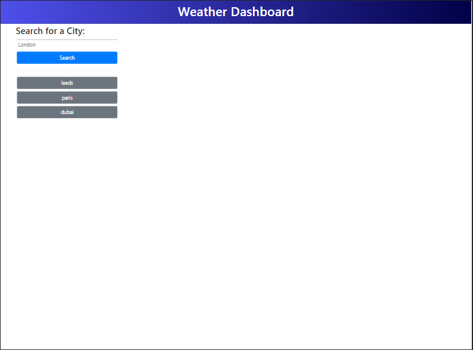
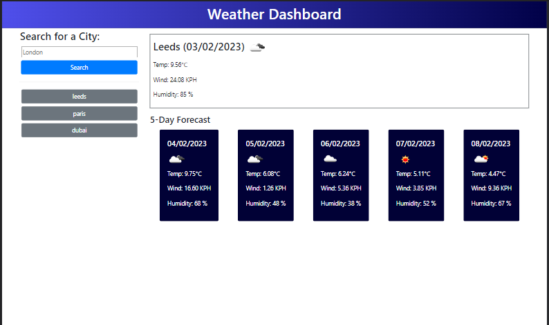

# Weather-Dashboard

## Description

JavaScript weather dashboard to help users track forecast in cities of interest, for current and 5 day forecast.

Daily information includes:

* date
* icon
* temperature
* wind speed in kilometers per hour
* humidity

## Technologies

A list of technologies used within the project:
* Moment.js (https://momentjs.com/): Version 2.29.4
* Jquery (https://jquery.com/): Version 3.2.1
* Bootstraps (https://getbootstrap.com/): Version 4.3.1
* Font awesome (https://fontawesome.com/): Version 4.7.0

## Installation

N/a

## Usage

[Access Weather Dashboard Application](https://rbenameur.github.io/Weather-Dashboard "Link to deployed github page")

In order to commence the weather search enter a city in the input below 'Search for a city:' and click 'Search'

The city name is used to fetch data from the OpenWeatherMap API. Relevant parts of the data retrieved are displayed to show current weather and 5 day forecast which represented the weather at noon on each day. The search is saved into local storage and when the user re-enters the site buttons in the aside on the left update with all recent searches. The user can click these buttons to generate a search.

## Credits

N/a

## License

Please refer to the LICENSE in the repo.
